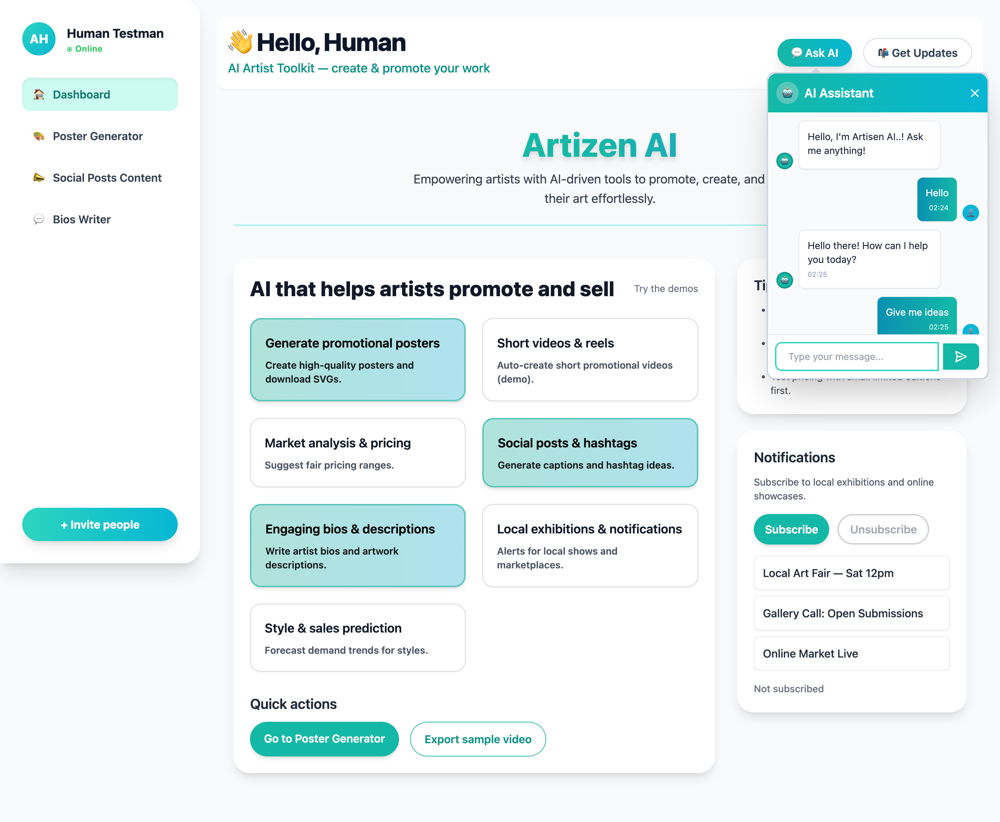

# 🧠 Artizen AI – Marketplace Dashboard

**Artizen AI** (Artisan + Citizen + AI) is a smart, AI-powered dashboard built to empower local artisans through streamlined tools and insights.

---

## 🔗 Live Demo (Deployed on Vercel)
**https://artizen-ai-flax.vercel.app/**

  

---

## 🚀 Tech Stack
- ⚛️ React
- ⚡ Vite
- 🎨 Tailwind CSS
- 🧠 OpenAI API (integrated)
- 🌐 Express (backend)

---

## 📦 Getting Started (Run the given commands to run)
To run the repository locally, follow the following steps.

### Step 1 - Add your API Key
- Open the .env file in the root directory.
- Paste your API key where required in the file.
- Save the .env file.

### Step 2 - **Open Terminal** and Install dependencies
    npm install

### Step 3 - Start the development server
    npm run dev
    
### Step 4 - **Open new Terminal** and Run Node Server (Backend)
    node server.js

### Step 5. Open generated link in the browser.
    http://localhost:5173/
